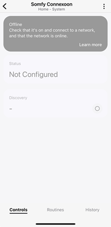
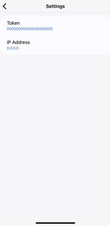
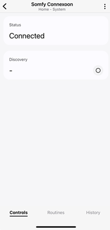
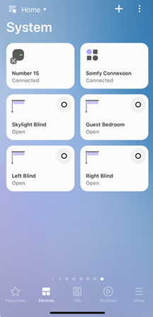
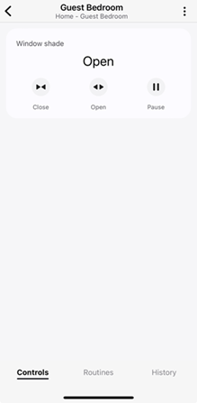

# Somfy Connexoon Edge Driver
This is a Smartthings Edge Driver for Somfy Connexoon. 

The driver has been developed to work with Connexoon Hubs and currently only supports the discovery of Somfy blinds (RTS). More Somfy devices can be added (Roller shutters, Windows, Curtains, etc) - Just ask me!

The edge driver should also work with Somfy Tahoma Hubs. However, this has not been tested.

## Prerequisites

You will need the following hardware:
- Smartthings Hub
- Somfy Connexoon Hub

## Setup

### 1. Configure your Connexoon hub 

Register all your Somfy RTS products on the Connexoon using the instructions that came with the product. Then, activate it at (https://www.somfy-connect.com).

### 2. Generate and Activate your API Token

The API Token is required for sending authenticated API requests from Smartthings to the Connexoon over the local network.

Generate and Activate an API Token using using the instructions [here](https://github.com/Somfy-Developer/Somfy-TaHoma-Developer-Mode).

> [!IMPORTANT]
> Australian users should use the same instructions above but replace `{{url}}` with `ha201-1.overkiz.com`

### 3. Channel enrollment and driver installation

Enroll your hub into my Smartthings production channel [here](https://callaway.smartthings.com/channels/d9a44c51-f5db-4849-81a6-dc7c6b3540ff). Then, find and install the Edge Driver called ST-Edge-SomfyConnexoon.

### 4. Discover the Somfy Connexoon in Smartthings

In the Smartthings app, you can now discover the Somfy Connexoon.

Open the Smartthings app then select ***Add device*** > ***Scan for nearby devices*** 

> [!NOTE]
> Once the Somfy Connexoon has been discovered, it will appear offline until you configure the IP address and Token in the device settings.

### 5. Configure the Somfy Connexoon in Smartthings

Open the discovered device then tap the vertical ellipsis and choose settings. Here you can enter the IP address and Token for your Connexoon.  
  

> [!IMPORTANT]
> Get the IP address by pinging `gateway-{pin}.local`, where `{PIN}` is the PIN recorded on the bottom of the Connexoon. For example, `gayeway-1000-2000-3000.local`. 

> [!TIP]
> It is not possible to set a static IP for the Connexoon. Consider setting an IP address reservation on your router instead so that the IP address does not change.

If everything has been configured correctly the Somfy Connexoon should be online and connected.  
  

### 5. Discover your Somfy devices

Tap on the Discovery button to find all your Somfy devices. You will see them appear as seperate devices on your dashboard.
  

